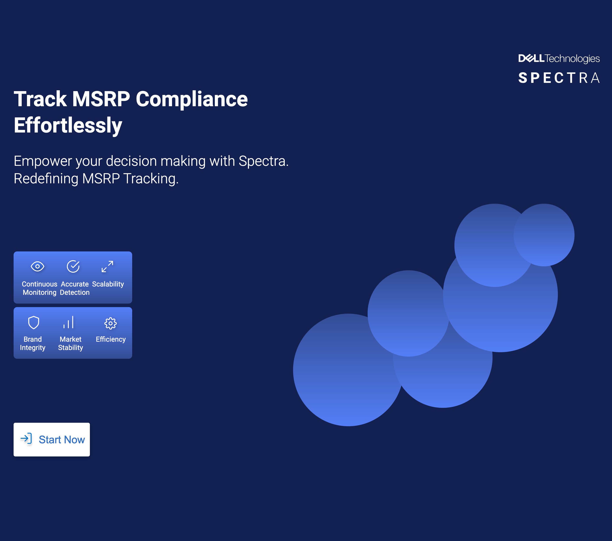
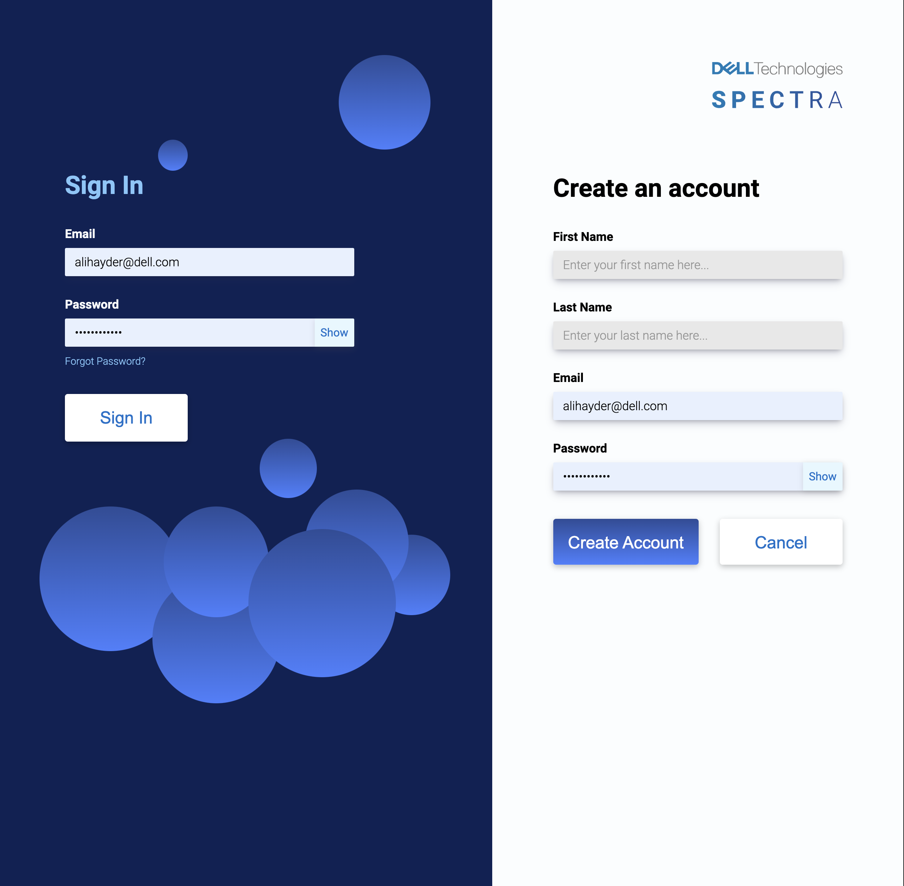
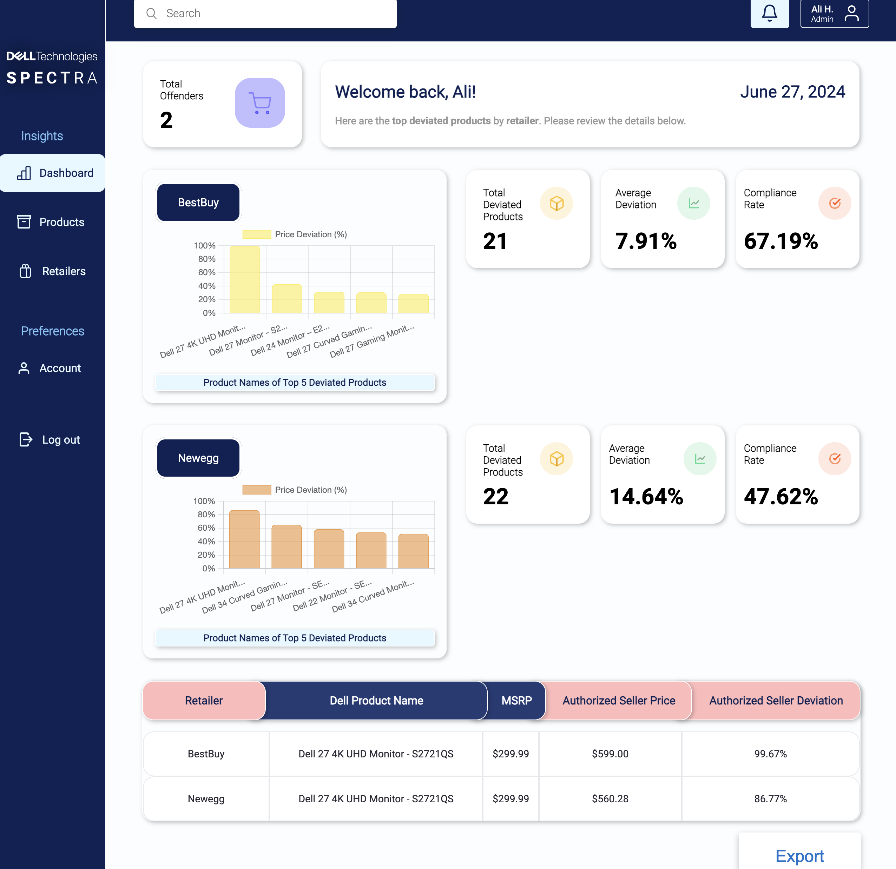
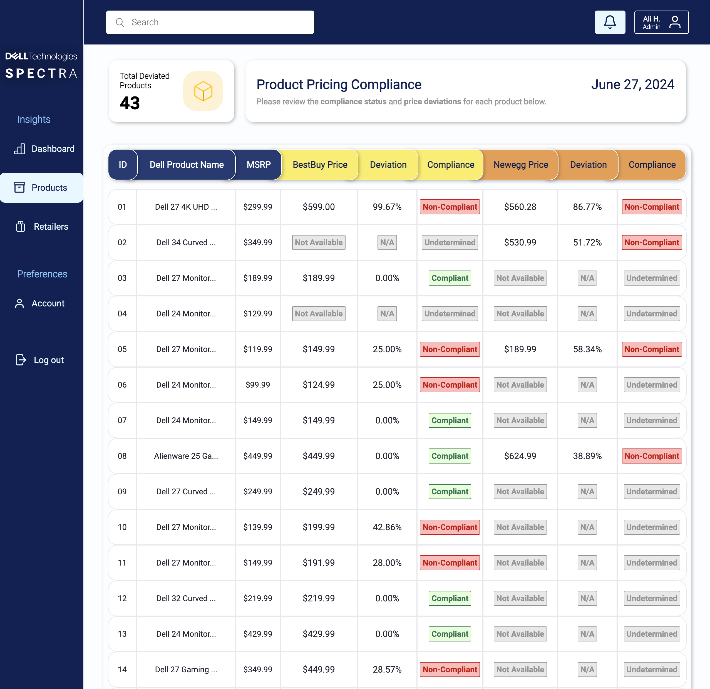
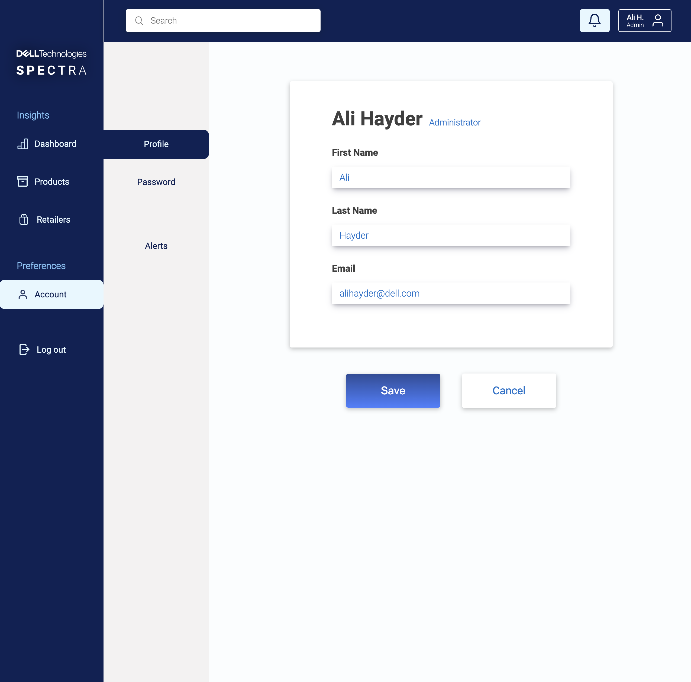
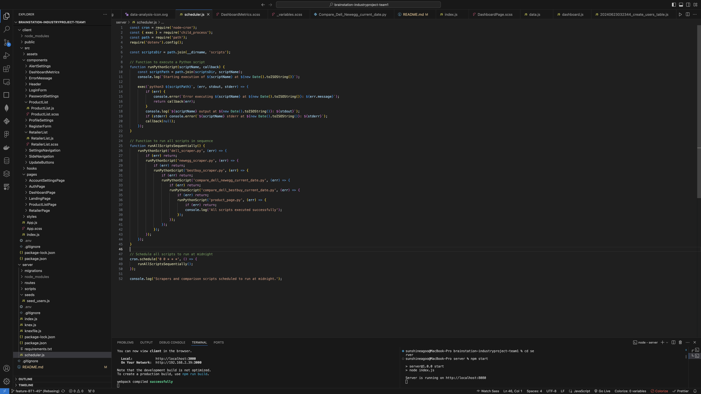
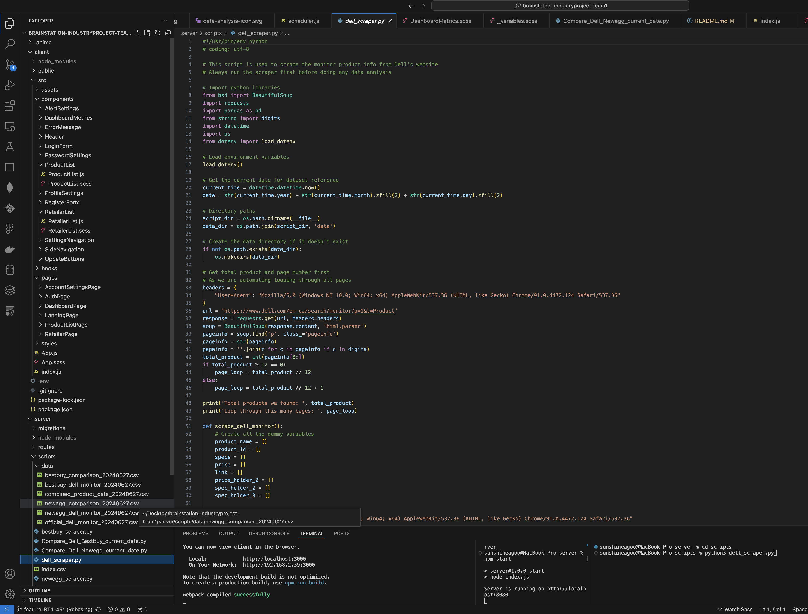

# Project: Spectra - Delivered by Team 1

## Overview
Spectra is a PaaS solution that helps monitor and ensure MSRP compliance across authorized retailers from an e-commerce perspective for Dell Technologies. It tracks and identifies non-compliant pricing with high accuracy and supports scalability for a growing array of products and retailer platforms.

## Problem
Dell Technologies manufactures and sells technology products to customers through two primary channels:
1. Direct selling (we sell directly to the customer)
2. Retailers (retailers sell to the customer)

Dell Technologies requires retailers to adhere to their specified MSRPs (Manufacturer Suggested Retail Price). This practice helps maintain Dell Technologies’ brand perception, stabilize market prices, and prevent retailers from cannibalizing Dell’s direct sales.

## User Profile
The lead data scientist at Dell Technologies in the Merchandising/Growth/Pricing department is responsible for tracking MSRP compliance. Based in Round Rock, Texas, this role involves flagging retailers guilty of underpricing to maintain Dell’s brand perception and market stability. The main goals include efficiently identifying top offending retailers and products, tracking price deviations, and exporting and sharing compliance reports. Motivations include maintaining market prices, preventing the undermining of Dell’s direct sales, and ensuring adherence to MSRP guidelines.

## Features
- Continuous monitoring of product prices
- Detection of MSRP deviations
- Ranking of top offending products by retailer
- Dashboard for visualizing compliance data
- Alerts and notifications for non-compliant pricing

## Tech Stack

### Frontend
- React.js
- react-router-dom
- Axios
- Sass

### Backend
- Node.js
- Express.js
- Knex
- Python

### Database
- MySQL

### Authentication
- jsonwebtoken
- bcrypt

### Utilities
- cors
- dotenv
- uuid

## Pages and Components

### Landing Page
The Landing Page serves as the entry point to the application, providing a brief introduction and overview of the services offered. The page contains a 'Start Now' button which routes the user to the Authorization Page to log in or create an account.

### Authorization Page (Login / Register)
This page handles user authentication, offering both login and registration functionalities. It uses React.js for form handling and validation, Axios for making secure API post requests with the login/register payload info, and jsonwebtoken stored in localStorage for managing user sessions. Passwords are securely hashed using bcrypt and stored along with the user data in a MySQL database.

### Navigation & Header
The Navigation and Header components provide a consistent user interface across the application. They include links to different pages, user account information, and are implemented using react-router-dom for seamless navigation. The alert's icon in the header routes directly to the Alert's notification tab. Each tab in the navigation routes directly to the selected page and applies conditional styling to the page list. Everything is functional and working.

### The Spectra Dashboard
The Spectra dashboard offers a comprehensive and intuitive interface for monitoring MSRP compliance. It displays key metrics such as total offenders, top 5 deviated products, average deviation, and compliance rates. Users can view retailer-specific data, giving them a high-level view of their MSRP compliance. The dashboard also includes dynamic alerts and the ability to generate detailed compliance reports, making it easy for users to take actionable steps to address pricing discrepancies. With its user-friendly design and robust data visualization, the Spectra dashboard empowers Dell Technologies to efficiently manage and ensure MSRP compliance across multiple retailers.

### Product List Page
The Product List Page displays a list of products with their pricing details from different retailers. It uses React.js for state management and dynamic content updates, Axios for fetching data from the backend, and functional custom sorting and filtering logic to present the data efficiently. Just click on each table header to sort that column. Pricing compliance and deviations are highlighted with specific styles using Sass. There is also an Export button at the bottom which is functional and will export a .csv file to the user's local machine.

### Account Settings Page
The Account Settings Page allows users to update their personal information and preferences. It includes form validation, secure data handling with Axios, and integrates with the backend to persist changes in the MySQL database. The page ensures user data security and integrity using jsonwebtoken for authentication and bcrypt for password management. This is also functional and you can successfully edit all user information from this page.

## Installation

### Prerequisites - Please Install
- Node.js
- Python
- MySQL

#### Windows Specific Instructions
1. Install Node.js and npm:
- Download and install Node.js from nodejs.org.
- Verify installation:
  - node -v
  - npm -v

2. Install Python:
- Download and install Python from python.org.
- Ensure to add Python to your PATH during installation.
- Verify installation:
  - python --version

3. Install MySQL:
- Download and install MySQL from dev.mysql.com.
- During installation, configure MySQL server and create a root user with a password.
- Verify installation:
  - mysql --version

#### Mac Specific Instructions
1. Install Homebrew:
- Open Terminal and run:
  - /bin/bash -c "$(curl -fsSL https://raw.githubusercontent.com/Homebrew/install/HEAD/install.sh)"
- Verify installation:
  - brew -v

2. Install Node.js and npm:
- Run:
  - brew install node
- Verify installation:
  - node -v
  - npm -v

3. Install Python:
- Run:
  - brew install python
- Verify installation:
  - python3 --version

4. Install MySQL:
- Run:
  - brew install mysql

- Start MySQL server:
  - brew services start mysql

- Set up MySQL secure installation:
  - mysql_secure_installation

- Verify installation:
  - mysql --version

### Steps
1. Clone the repository:
- In bash:
  - git clone https://github.com/nickdoucette24/brainstation-industryproject-team1.git
  - cd brainstation-industryproject-team1

2. Install dependencies:
- npm install
- npm install -g knex
- pip install -r requirements.txt

3. Create .env files:
- In the client folder, create a .env file with the following content:
REACT_APP_BASE_URL=http://localhost:8080
- In the server root folder, create a .env file with the following content:

**# Port**
PORT=8080

**# Database Variables**
DB_HOST=127.0.0.1
DB_NAME=Dell
DB_USER=root
DB_PASSWORD=rootroot

**# CORS**
CORS_ORIGIN=http://localhost:3000

**# JWT Config**
JWT_SECRET=your_jwt_secret
JWT_EXPIRY=1h

**# Data Directory**
DATA_DIR=./scripts/data

4. Configure the database:
- Log in to MySQL
  - mysql -u root -p
- Create the Dell database
  - CREATE DATABASE DELL;

5. Run database migrations:
- npx knex migrate:latest
- npx knex seed:run

6. Start the server:
- npm start

7. Start the frontend:
- npm start
- Press `Cmd + R` (Mac) or `Ctrl + R` (Windows/Linux) if your screen is blank

8. Automated Data Scraping:
- The server is configured to scrape data automatically at midnight to ensure up-to-date pricing information. This scheduled task scrapes the data from authorized retailer websites and updates the database.

**Handling Errors - Missing CSV File**

9. If the terminal outputs an error indicating a missing CSV file, you may need to perform a manual scrape to obtain the required data.
Follow these instructions for manual scraping.
- To manually scrape data, navigate to the data folder and run the Python script:
- cd scripts/data
  - python3 dell_scraper.py
  - python3 bestbuy_scraper.py
  - python3 newegg_scraper.py
  - python3 Compare_Dell_Bestbuy_current_date.py
  - python3 Compare_Dell_Newegg_current_date.py
  - python3 product_page.py
  
### Notes:
- By following these steps, you can set up the Spectra platform, ensure it is scraping data on schedule, and manually trigger data scrapes when needed. This comprehensive setup allows Dell Technologies to maintain accurate and up-to-date MSRP compliance monitoring across its retailer network.

### Contact Us
- **Team Spectra (for general inquiries):** team1.spectra@gmail.com
- **Sunshine Agoo (Team Lead):** sunshine.agoo@gmail.com
- **Nick Doucette (Head of Software Engineering):** nickdoucette24@gmail.com
- **Alessandra Bondoc (Head of User Experience Design):** alessandra.bondoc@gmail.com 
- **Xiaozhuo Chelsea Wu (Head of Data Science):** xiaozhuowu@hotmail.com